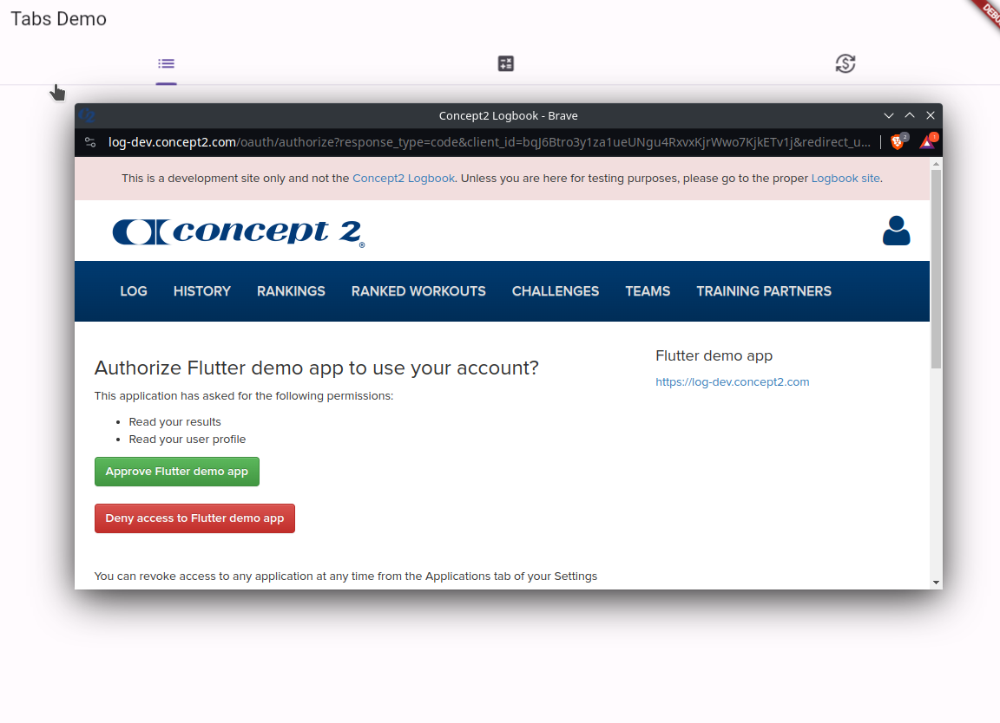
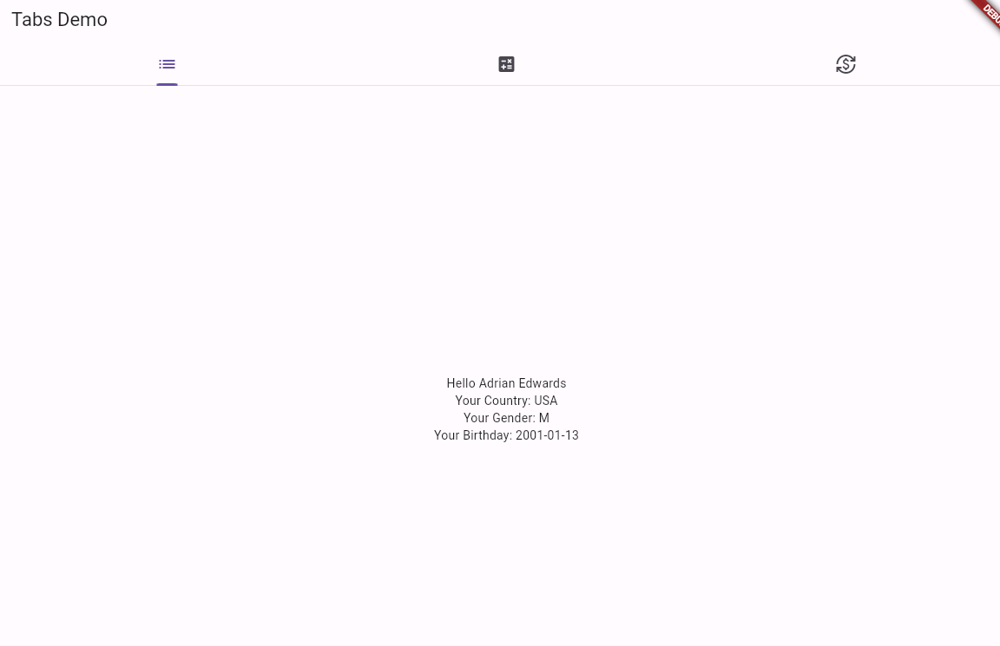

# c2logbook example application

This is a web-based application written in Flutter primarily intended to be a basic demo of how to use the `c2logbook` Flutter wrapper. 

See Concept2 Logbook API documentation at https://log.concept2.com/developers/documentation/

## Functionality walkthrough

This app prompts you to log into your concept2 logbook account using the testing domain. This uses Oauth and allows the app to access your account on your behalf. 

Once logged in, the app will display some basic user information fetched from your account:

## Setup (for local development or running)

This assumes you have your environment correctly configured for [Web development with flutter](https://docs.flutter.dev/platform-integration/web/building).

1. Go to the Concept2 developer site and [create an application using the developer site](https://log-dev.concept2.com/developers/keys) to get client ID and secret credentials. ([Documentation](https://log.concept2.com/developers/documentation/) is also available)
2. run the flutter frontend code using the command: `flutter run -d chrome --dart-define C2_LOGBOOK_CLIENT_ID=[CLIENT ID HERE] --dart-define C2_LOGBOOK_CLIENT_SECRET=[CLIENT SECRET HERE]`
3. ensure that the python bridge is also running and able to serve HTTP requests. this is available in a separate repository and should be run on port 8080

